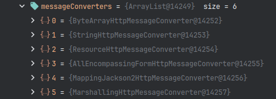
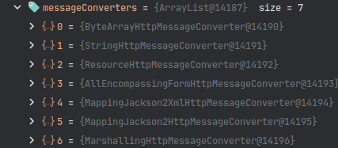

# Test of the XML marshallers

Test repository for setting of a XML marshaller in SpringBoot 3. After release 3.4.3 there is a new default marshaller added to the spring web/rest client.

Here are images of the default mesasages converters of the rest client. The MarshallingHttpMessageConverter was added by the code.

The MappingJackson2XmlHttpMessageConverter was added to the default rest client in SpingBoot 3.4.4 and overrules the MarshallingHttpMessageConverter so the test will fail after upgrading the version.